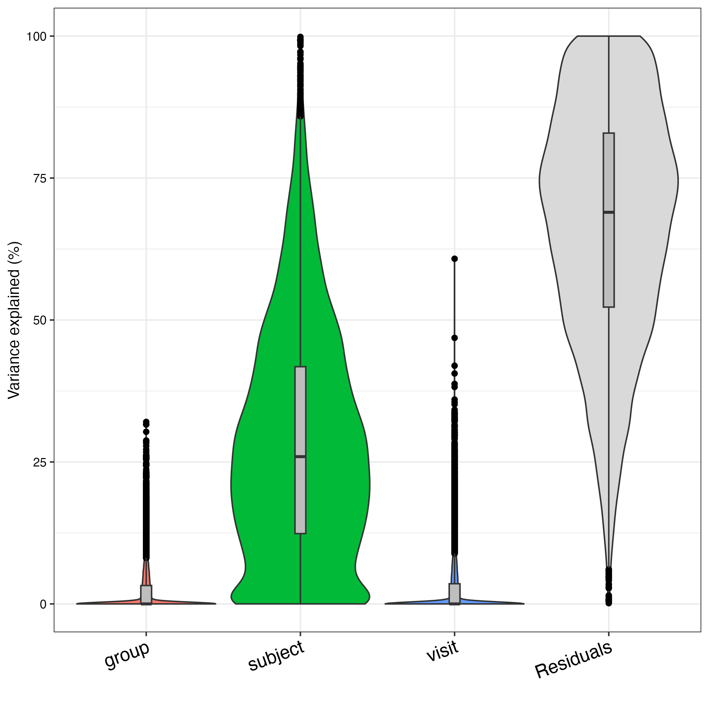
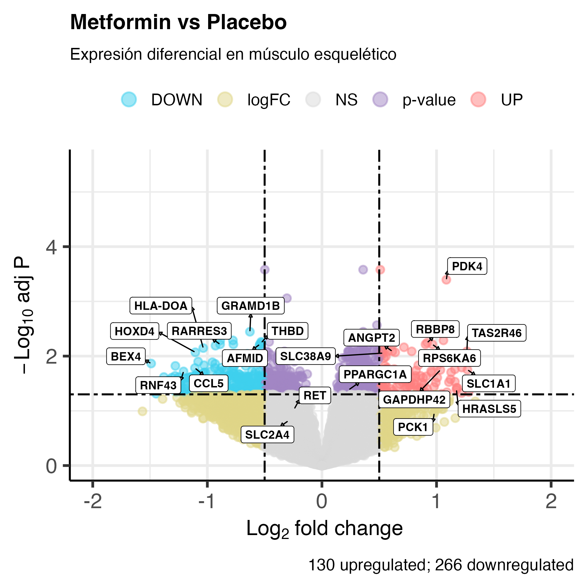
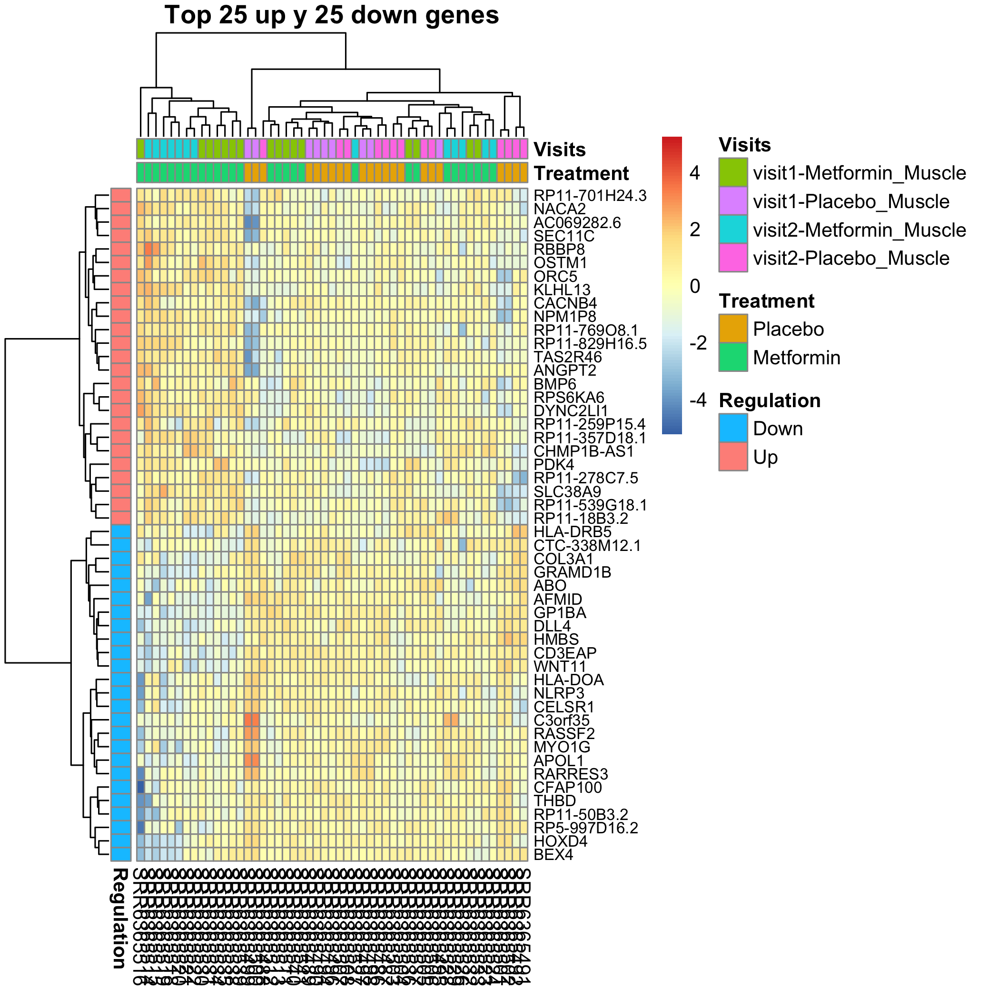
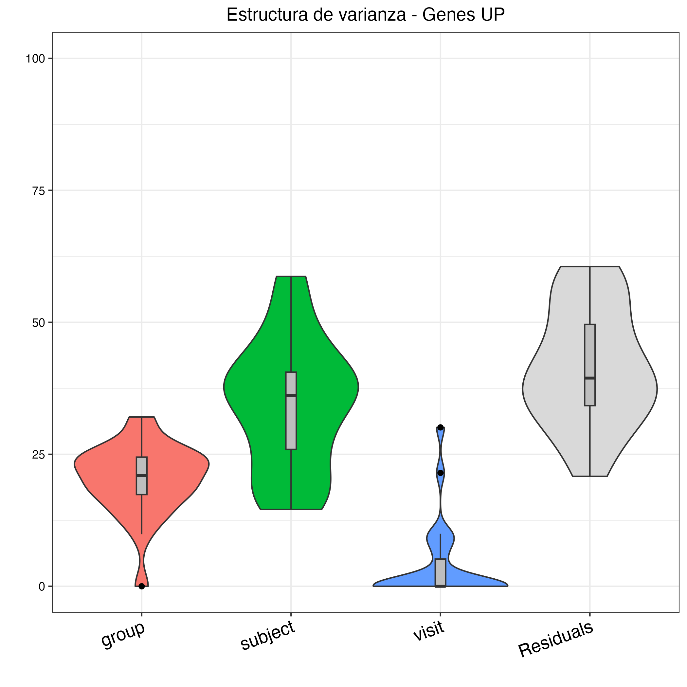
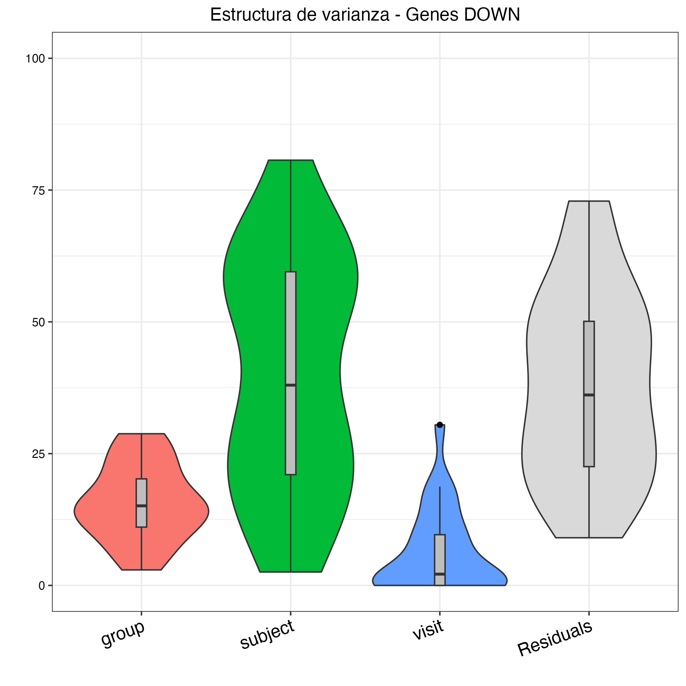
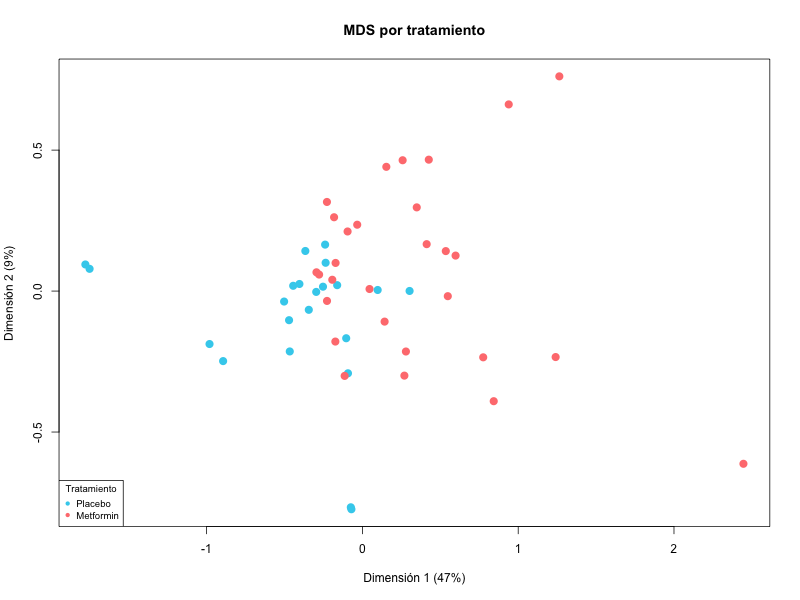

# Análisis transcriptómico de la respuesta a la metformina en el músculo esquelético de adultos mayores

Este repositorio contiene el flujo de trabajo bioinformático para el análisis de expresión diferencial de ARN-seq del proyecto SRP126485 ("*Metformin regulates metabolic and nonmetabolic pathways in skeletal muscle and subcutaneous adipose tissues of older adults*") (https://doi.org/10.1111/acel.12723), obtenido a través de la plataforma [recount3](https://rna.recount.bio/). El estudio se centra en la caracterización de los cambios moleculares inducidos por la metformina en el músculo esquelético de adultos mayores.
Este estudio evalúo el impacto transcriptómico de la metformina en una cohorte de 14 adultos mayores (~70 años) mediante un diseño de estudio cruzado, aleatorizado y doble ciego. A partir de muestras de músculo esquelético y tejido adiposo subcutáneo, se comparan los perfiles de expresión tras seis semanas de tratamiento con metformina frente a un periodo equivalente con placebo.

## Contexto biológico
La metformina es un fármaco ampliamente utilizado para el tratamiento de la diabetes tipo 2. Sus principales efectos incluyen:
- Activación de AMPK
- Modulación del metabolismo mitocondrial
- Regulación de la oxidación de ácidos grasos
- Inhibición indirecta de la gluconeogénesis

Aunque sus efectos hepáticos han sido ampliamente estudiados, su impacto transcriptómico en músculo esquelético aún no está completamente caracterizado. La metformina es reconocida no solo como un fármaco antihiperglucemiante, sino como un modulador metabólico con efectos pleiotrópicos. En los últimos años, la metformina ha despertado interés como posible intervención geroprotectora debido a su asociación con mejoras en parámetros metabólicos, reducción de inflamación crónica de bajo grado y potencial modulación de vías relacionadas con longevidad. Estudios clínicos y epidemiológicos han sugerido que podría tener beneficios más allá del control glucémico, incluyendo efectos sobre envejecimiento saludable y enfermedades asociadas a la edad.

Este proyecto analiza cambios en la expresión génica en músculo esquelético tras tratamiento con metformina comparado con placebo, considerando que las muestras provienen de sujetos medidos en múltiples visitas (diseño con medidas repetidas). Dado que el músculo es un tejido central en el metabolismo sistémico y en el deterioro asociado al envejecimiento (p. ej., sarcopenia y resistencia a insulina), caracterizar su respuesta transcriptómica a metformina puede aportar información relevante tanto en el contexto metabólico como geriátrico.
## Objetivos

### Objetivo general

Caracterizar la firma transcriptómica inducida por el tratamiento con metformina en el músculo esquelético de adultos mayores y su posible rol geroprotector

### Objetivos particulares

- Descargar y accesar a datos de expresión mediante recount3
- Limpiar, normalizar y evaluar la calidad de los datos
- Analizar la contribución relativa a la varianza de variables al perfil de expresión
- Emplear modelos de expresión diferencial para identificar genes modulados por la intervención farmacológica.
- Visualizar las firmas moleculares mediante MDS, Volcano Plots y mapas de calor para facilitar la interpretación biológica de los hallazgos

## Estructura del repositorio

```
Proyecto/
│
├── code/                                 # Scripts
│   ├── descargar_data_muscle.R
│   └── Analisis_DE.R
│
├── results/                              # Imagenes en PDF
│   └── plots/                            # Imagenes en png
│
├── raw_data/                             # Datos originales sin procesar
│   └── rse_gene_SRP126485.rds
│
├── processed_data/                       # Datos procesados y csv de resultadas
│   ├── dge_muscle.rds
│   ├── rse_muscle.rds
│   ├── rse_muscle_filtered.rds
│   ├── UP_genes.csv
│   ├── DOWN_genes.csv
│   └── FDR-only.csv
│
├── Report/                               # Reporte de proyecto
│   ├── Proyecto.pdf
│   └── Proyecto.md
│
├── README.md                             # Descripción del proyecto
├── LICENSE                               # Licencia del proyecto
└── .gitignore                             # Archivos y carpetas a ignorar por git
```


## Dataset
Los datos fueron obtenidos del repositorio recount3 y organizados como un objeto `RangedSummarizedExperiment`.
- 57 muestras de músculo
- 63,856 genes
- Diseño longitudinal con múltiples muestras por sujeto

Variables principales:

- `drug`: Metformin / Placebo

- `subject`: identificador del individuo

- `source_name`: visita temporal

Debido a la presencia de muestras repetidas por sujeto, se utilizó un modelo lineal mixto.


## Resumen del flujo de análisis
**Descarga y construcción del objeto RSE:**
El paquete recount3 fue utilizado para descargar los datos de RNA-seq correspondientes al estudio seleccionado. Se construyó un objeto RangedSummarizedExperiment (RSE) con los datos de músculo esquelético que contiene los conteos de lectura a nivel génico (posteriormente convertidos a cuentas por gen) y la metadata expandida a partir de los atributos SRA para cada muestra.

**Control de calidad y filtrado:**
Se calculó la profundidad de secuenciación de cada muestra, así como la proporción de lecturas asignadas a genes (assigned reads / total reads), con el objetivo de evaluar la calidad de la secuenciación y descartar posibles muestras con bajo rendimiento técnico. Posteriormente, los conteos fueron extraídos del objeto `RangedSummarizedExperiment` y convertidos a un objeto `DGEList` del paquete edgeR. Se aplicó la función `filterByExpr()` para eliminar genes con baja expresión, reteniéndose un total de 18,509 genes para el análisis posterior. Finalmente, la normalización por tamaño de librería se realizó mediante el método TMM utilizando la función `calcNormFactors()`.

- Análisis de `variancePartition`: Dada la complejidad del diseño experimental (medidas repetidas y alta heterogeneidad biológica en adultos mayores) se empleó este paquete para para desglosar la contribución de las variables del estudio a la variación total de la expresión génica. Se analizaron las tres variables principales y se identificó que la identidad del **Sujeto** es la fuente dominante de variabilidad, lo que justificó el uso de modelos de efectos mixtos.

**Análisis de expresión diferencial:**
- Se utilizó `voomWithDreamWeights()` para transformar los conteos a valores log-CPM e incorporar pesos de precisión, permitiendo modelado lineal apropiado bajo un marco heterocedástico.
- Se utilizó `dream` para integrar la variabilidad interindividual como un efecto aleatorio dentro del marco de trabajo de `limma/voom`y para incrementar la potencia estadística para detectar señales sutiles de la intervención farmacológica frente al ruido biológico individual, dadas las propiedades de los modelos lineales mixtos.
- Se aplicó moderación empírica Bayesiana `eBayes` para obtener estadísticas moderadas, log2 fold-changes y valores p ajustados (FDR). Se identificaron genes diferencialmente expresados bajo el contraste Metformin vs Placebo utilizando un umbral de FDR < 0.05 (con base al estudio de referenia).

**Visualización:**
Se generaron las siguientes visualizaciones para resumir los resultados:

- MDS plot (estructura global de las muestras)

- MA plot

- Volcano plot (EnhancedVolcano)

- Heatmap de los genes más significativamente regulados

- Gráficos de partición de varianza


## Resultados

### Varianza interindividual


El factor ‘subject’ (sujeto) emergió como una fuente significativa de variación, explicando una proporción sustancial de la
varianza en un gran número de genes, lo que justifica su inclusión en el modelo lineal para controlar la heterogeneidad interindividual. Cabe
destacar que se observó una fracción elevada de varianza residual, lo que sugiere la presencia de
ruido técnico o biológico no capturado por el diseño inicial

### MA-Plot


En el MA plot se observa que la mayoría de los genes significativamente expresados (FDR < 0.05)
presentan cambios moderados en la expresión (logFC entre -1 y 1). Esto sugiere que, aunque
existen diferencias estadísticamente significativas, la respuesta al tratamiento con metformina en
músculo esquelético no es masiva, sino que se manifiesta como ajustes finos y moderados en la
expresión génica.

### Volcano Plot


Se identificaron 921 genes diferencialmente expresados bajo un umbral de FDR < 0.05. De estos, 130 presentaron sobreexpresión y 266 mostraron subexpresión con un |log2FC| superior a 0.5. Adicionalmente, 525 genes alcanzaron significancia estadística, pero no superaron el umbral de cambio en la magnitud del efecto (|log2FC| ≤ 0.5).
Entre los genes con mayor significancia y magnitud destacan PDK4, SLC1A1, CCL5 y HLA-DOA. 

### Heatmap


el análisis de agrupamiento jerárquico (Heatmap) de los 50 genes con mayor varianza
estadística reveló patrones de expresión consistentes con la acción de la metformina, logrando
distinguir bloques de regulación positiva y negativa bien definidos. Si bien el dendrograma de
muestras reflejó la predominancia de la variabilidad interindividual —confirmando los hallazgos del
análisis de partición de varianza—, los genes seleccionados mostraron una respuesta coordinada
al tratamiento. Marcadores como PDK4, AFMID y THBD exhibieron perfiles de expresión
contrastantes entre condiciones, sugiriendo que la metformina induce una reprogramación
metabólica específica en el músculo esquelético que trasciende el ruido biológico basal de los
sujetos.

### Variance Partition de genes DE




En los genes sobreexpresados se observa un claro enriquecimiento de la varianza explicada por el tratamiento. Aunque el efecto global de la metformina es moderado a nivel transcriptómico, en este subconjunto el factor group llega a explicar hasta el 30% de la variabilidad total. La reducción de la varianza residual y la estabilidad del efecto sujeto sugieren una respuesta biológica consistente que supera la heterogeneidad interindividual basal.
En los genes subexpresados, el tratamiento explica una proporción relevante de la variabilidad (mediana ~18%), muy por encima del nivel basal genómico. El efecto sujeto permanece predominante, indicando que la magnitud de la inhibición inducida por metformina depende parcialmente del perfil individual. La reducción de la varianza residual respalda la robustez estadística de estos cambios, particularmente en vías asociadas a inflamación y remodelado extracelular.

### MDS

El MDS restringido a los genes diferencialmente expresados explicó el 57% de la varianza total (45% en la primera dimensión), separando claramente metformina de placebo. Esto confirma que, pese a la variabilidad interindividual, existe una firma transcriptómica coordinada inducida por el tratamiento.

### Genes diferencialmente expresados
Para más información checar el reporte: `Report/Proyecto.pdf`

#### Sobreexpresados

La firma de genes sobreexpresados sugiere que la metformina actúa como modulador de resiliencia metabólica en músculo envejecido. La regulación positiva de PDK4 y SLC38A9 apunta a una mejora en la flexibilidad metabólica, mientras que genes como RPS6KA6 y RBBP8 sugieren optimización de supervivencia y reparación celular. Asimismo, la activación de mecanismos de proteostasis (NACA2, SEC11C, OSTM1) respalda una mejora en el control de calidad proteico, proceso clave frente a la sarcopenia. En conjunto, estos cambios indican que el efecto de la metformina trasciende el control glucémico, promoviendo mantenimiento funcional y adaptación celular en el adulto mayor.

#### Subexpresados

La regulación negativa inducida por metformina refleja una desactivación coordinada de procesos asociados al envejecimiento muscular. La disminución de genes como NLRP3 y HLA-DOA sugiere atenuación del inflammaging, mientras que la reducción de componentes de matriz extracelular como COL3A1 y WNT11 apunta a menor remodelado fibrótico. Asimismo, la inhibición de reguladores del metabolismo lipídico (GRAMD1B, APOL1) y de factores de proliferación (HOXD4, RASSF2) indica una transición hacia un estado de mayor eficiencia metabólica y mantenimiento celular. En conjunto, esta firma transcriptómica sugiere un efecto geroprotector que reduce inflamación y rigidez estructural, favoreciendo la funcionalidad del músculo envejecido.


## Requisitos técnicos

### Software
- Linux o macOS recomendado (compatible con Windows, puede requerir ajustes)
- R (>= 4.4.0)
- RStudio (recomendado) o Positron
- Git
- Cuenta de GitHub

### Paquetes de R

```r
# CRAN
packages_cran <- c( "sessioninfo", "ggplot2", "pheatmap", knitr)
install.packages(packages_cran)

# Bioconductor
if (!requireNamespace("BiocManager", quietly = TRUE))
    install.packages("BiocManager")

packages_bioc <- c(
    "recount3", "SummarizedExperiment", "GenomicRanges",
    "edgeR", "limma", "ExploreModelMatrix", "variancePartition", "EnhancedVolcano")
)
BiocManager::install(packages_bioc)

```

## Reproducibilidad
Para asegurar la transparencia y reproducibilidad de este análisis, se incluye un archivo de reporte dinámico (R Markdown).
1. Abra el archivo `analisis_metformina.Rmd` en RStudio.
2. Asegúrese de tener instaladas las dependencias mencionadas en la sección 4.
3. Haga clic en el botón **"Knit"** o ejecute `rmarkdown::render("analisis_metformina.Rmd")`.
4. Esto generará un archivo HTML con todo el código, las visualizaciones de varianza y la discusión de resultados integrada.

## Referencias
**Kulkarni, A. S., Brutsaert, E. F., Anghel, V., Zhang, K., Bloomgarden, N., Pollak, M., Mar, J. C., Hawkins, M., Crandall, J. P., & Barzilai, N.** (2018). Metformin regulates metabolic and nonmetabolic pathways in skeletal muscle and subcutaneous adipose tissues of older adults. *Aging Cell*, 17(2). (https://doi.org/10.1111/acel.12723)
**Collado-Torres L, et al.** (2017). "Reproducible RNA-seq analysis using recount2". *Nature Biotechnology*. [DOI: 10.1038/nbt.3838](https://doi.org/10.1038/nbt.3838)
**Dutta, S., Shah, R. B., Singhal, S., Dutta, S. B., Bansal, S., Sinha, S., & Haque, M.** (2023). Metformin: A Review of Potential Mechanism and Therapeutic Utility Beyond Diabetes. *Drug Design Development And Therapy*, Volume 17, 1907-1932. (https://doi.org/10.2147/dddt.s409373)
**Kulkarni, A. S., Gubbi, S., & Barzilai, N**. (2020). Benefits of Metformin in Attenuating the Hallmarks of Aging. *Cell Metabolism*, 32(1), 15-30. (https://doi.org/10.1016/j.cmet.2020.04.001)
**Blighe, K.** (2018). EnhancedVolcano. *NCI BioConductor*. https://doi.org/10.18129/b9.bioc.enhancedvolcano
**Collado-Torres, L.** (2024). recount3. *NCI BioConductor*. https://doi.org/10.18129/b9.bioc.recount3
**Hoffman, G. E.** (2017). VariancePartition. *NCI BioConductor*. https://doi.org/10.18129/b9.bioc.variancepartition

##  Contacto

**Autor:**
- Ashley Yael Montiel Vargas
- Email: yaelmont@lcg.unam.mx
- GitHub: [Ashm0nt](https://github.com/Ashm0nt)

**Instructor:**
- Leonardo Collado-Torres
- Email: lcolladotor@gmail.com
- Bluesky: [@lcolladotor.bsky.social](https://bsky.app/profile/lcolladotor.bsky.social)
- GitHub: [lcolladotor](https://github.com/lcolladotor)

**Curso:**
- Introducción a RNA-seq - LCG-UNAM 2026
- Licenciatura en Ciencias Genómicas, UNAM


##  Información del Proyecto

| Concepto | Detalle |
|----------|---------|
| **Fecha de inicio** | 18 de febrero de 2026 |
| **Última actualización** | 23 de febrero de 2026 |
| **Versión** | 1.0 |
| **Licencia** | MIT |


